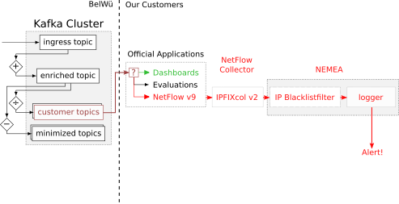

# NetFlow_NEMEA_Toolchain

This README describes a exemplary toolchain to use the bwNetFlow NetFlow v9 exporter together with NEMEA flow analysing tools.

## Installation of All Necessary Tools
The toolchain needs the following tools to work: bwNetFlow NetFlow v9 Exporter, ipfixcol2 and the NEMEA framework.
Follow the instructions of the respective tool for a proper installation.
 bwNetFlow NetFlow v9 Exporter: https://github.com/bwNetFlow/protobuf_to_netflow_converter
 ipfixcol2: https://github.com/CESNET/ipfixcol2
 NEMEA framework:https://github.com/CESNET/Nemea-Framework
